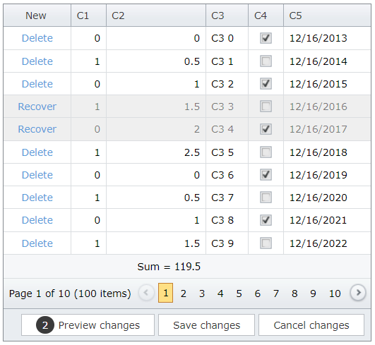

# Grid View for ASP.NET Web Forms - How to update total summaries on the client in batch edit mode when deleted rows are highlighted
<!-- run online -->
**[[Run Online]](https://codecentral.devexpress.com/t517531/)**
<!-- run online end -->

This example demonstrates how to calculate the total summary dynamically in batch edit mode when the grid's [HighlightDeletedRows](https://docs.devexpress.com/AspNet/DevExpress.Web.GridViewBatchEditSettings.HighlightDeletedRows) property is enabled. 



## Overview

### Create a Custom Summary Item

Add a total summary item for the corresponding column. Use the item's [Tag](https://docs.devexpress.com/AspNet/DevExpress.Web.ASPxSummaryItemBase.Tag) property to identify the summary item and get its value.

```aspx
<TotalSummary>
    <dx:ASPxSummaryItem SummaryType="Sum" FieldName="C2" Tag="C2_Sum" />
</TotalSummary>
```

```cs
protected object GetTotalSummaryValue() {
    ASPxSummaryItem summaryItem = Grid.TotalSummary.First(i => i.Tag == "C2_Sum");
    return Grid.GetTotalSummaryValue(summaryItem);
}
```

Replace the summary item with a custom [footer template](https://docs.devexpress.com/AspNet/DevExpress.Web.GridViewColumn.FooterTemplate).

```aspx
<dx:GridViewDataSpinEditColumn Width="100" FieldName="C2">
    <FooterTemplate>
        Sum =
        <dx:ASPxLabel ID="ASPxLabel1" runat="server" ClientInstanceName="labelSum" Text='<%# GetTotalSummaryValue() %>' />
    </FooterTemplate>
</dx:GridViewDataSpinEditColumn>
```

Handle the grid's client-side [BatchEditEndEditing](https://docs.devexpress.com/AspNet/js-ASPxClientGridView.BatchEditEndEditing) and [BatchEditRowDeleting](https://docs.devexpress.com/AspNet/js-ASPxClientGridView.BatchEditRowDeleting) events. In handlers, use the grid's [batchEditApi.GetCellValue](https://docs.devexpress.com/AspNet/js-ASPxClientGridViewBatchEditApi.GetCellValue(visibleIndex-columnFieldNameOrId)) method to get initial cell values and `rowValues` argument property to get new cell values. Then recalculate the summary value and assign it to the label.

```js
function OnBatchEditEndEditing(s, e) {
    CalculateSummary(s, e.rowValues, e.visibleIndex, false);
}
function CalculateSummary(grid, rowValues, visibleIndex, isDeleting) {
    var originalValue = grid.batchEditApi.GetCellValue(visibleIndex, "C2");
    var newValue = rowValues[(grid.GetColumnByField("C2").index)].value;
    var dif = isDeleting ? -newValue : newValue - originalValue;
    labelSum.SetValue((parseFloat(labelSum.GetValue()) + dif).toFixed(1));
}
function OnBatchEditRowDeleting(s, e) {
    CalculateSummary(s, e.rowValues, e.visibleIndex, true);
}
```

### Create a Custom Recovery Button

Use the command column's [CustomButtons](https://docs.devexpress.com/AspNet/DevExpress.Web.GridViewCommandColumn.CustomButtons) property to create a custom **Recovery** button.

```aspx
<dx:GridViewCommandColumn ShowNewButtonInHeader="true" ShowDeleteButton="true" ShowRecoverButton="true">
    <CustomButtons>
        <dx:GridViewCommandColumnCustomButton ID="customRecover" Text="Recover"></dx:GridViewCommandColumnCustomButton>
    </CustomButtons>
</dx:GridViewCommandColumn>
```

Add custom CSS classes to control the custom button's visibility based on a condition and hide the default **Recovery** button.

```aspx
<Styles>
    <CommandColumnItem CssClass="commandCell"></CommandColumnItem>
    <BatchEditDeletedRow CssClass="deletedRow"></BatchEditDeletedRow>
</Styles>
```

```css
.deletedRow a[data-args*="customRecover"].commandCell {
    display: inline !important;
}

a[data-args*="customRecover"].commandCell {
    display: none;
}

a[data-args*="Recover"].commandCell {
    display: none;
}
```

Handle the grid's client-side [CustomButtonClick](https://docs.devexpress.com/AspNet/js-ASPxClientGridView.CustomButtonClick) event to restore the deleted row and recalculate the total summary.

```js
function OnCustomButtonClick(s, e) {
    if (e.buttonID == 'customRecover') {
        s.batchEditApi.ResetChanges(e.visibleIndex);
        var value = s.batchEditApi.GetCellValue(e.visibleIndex, "C2");
        labelSum.SetValue((parseFloat(labelSum.GetValue()) + value).toFixed(1));
    }
}
```

## Files to Review

* [Default.aspx](./CS/Default.aspx) (VB: [Default.aspx](./VB/Default.aspx))
* [Default.aspx.cs](./CS/Default.aspx.cs) (VB: [Default.aspx.vb](./VB/Default.aspx.vb))

## Documentation

* [Grid in Batch Edit Mode](https://docs.devexpress.com/AspNet/16443/components/grid-view/concepts/edit-data/batch-edit-mode)

## More Examples

* [Grid View for ASP.NET Web Forms - How to update total summaries on the client in batch edit mode](https://github.com/DevExpress-Examples/asp-net-web-forms-grid-update-total-summaries-on-client-in-batch-mode)
* [Grid View for ASP.NET Web Forms - How to calculate values dynamically in batch edit mode](https://github.com/DevExpress-Examples/asp-net-web-forms-gridview-calculate-values-dynamically-batch-mode)
* [Grid View for ASP.NET Web Forms - How to calculate values and update total summaries dynamically in batch edit mode](https://github.com/DevExpress-Examples/asp-net-web-forms-grid-calculate-column-values-and-total-summaries-in-batch-mode)
* [Grid View for ASP.NET MVC - How to update total summaries on the client in batch edit mode](https://github.com/DevExpress-Examples/asp-net-mvc-grid-update-total-summaries-on-client-in-batch-mode)
